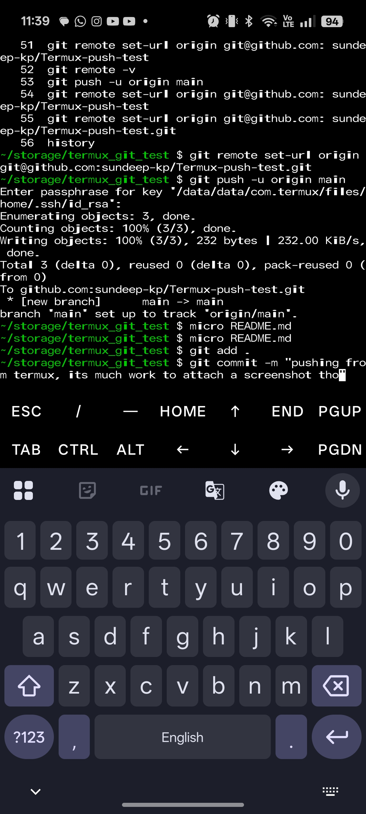

# Termux-push-test

<div align="center">


<p align="center">
  
  
  
  
</p>

</div>

---

### 🚀 Terminal Preview

Here is a visual representation of the environment:

```bash
# This block uses syntax highlighting for colors
user@iiitnr:~/termux_git_test$ ./init_system.sh

[OK] Loading Kernel....... 100%
[OK] Mounting Drive....... /storage/emulated/0
[OK] SSH Key.............. id_rsa.pub found

> initializing_repo... done.
> welcome_back_sundeep.

```
 
instructions to replicate --
: I used pkg install git
  pkg install micro git -v
   git -h
   git config --global user.name "username"
   git config --global user.email "<email>"
   git config user.name
   ssh-keygen -t rsa -C "email"
   cat ~/.ssh/id_rsa.pub | termux-clipboard-set
   pkg install termux-api
   cat ~/.ssh/id_rsa.pub | termux-clipboard-set
   ssh -T git@github.com
   ls
   cd storage/ {first mount your internal storage if you haven't else you may skip this and continue the steps on termux default directory instead}
   
  
  
   34  mkdir termux_git_test
   35  cd termux_git_test/

   here make your readme.md using a code editor(i am using micro -- so simply micro README.md)

then just 
	git remote add origin git@github.com:sundeep-kp/Termux-push-test.git

	or if you messed up add origin then 
	git remote set-url origin git@github.com:sundeep-kp/Termux-push-test.git

	git add . 
	git commit -m "pushing from termux, its much work to attach a screenshot tho"

	git push -u origin main
